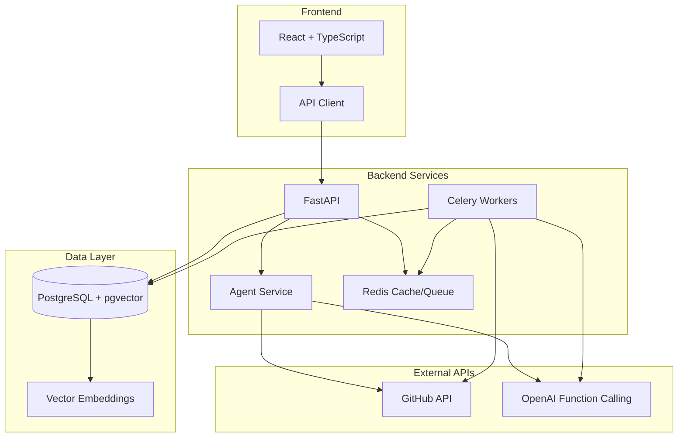

# DevIntel AI - Full-Stack Developer Productivity Platform

[](https://opensource.org/licenses/MIT)
[](https://www.python.org/downloads/)
[](https://fastapi.tiangolo.com/)
[](https://reactjs.org/)
[](https://www.typescriptlang.org/)
[](https://github.com/psf/black)
[](./devintel-backend/docs/SECURITY.md)

**DevIntel AI** is an AI-powered developer productivity platform that enables developers to connect GitHub repositories, index code bases, and chat with an AI assistant using Retrieval Augmented Generation (RAG). Get instant code insights, refactoring suggestions, and intelligent explanations.

## ✨ Key Features

- 🤖 **Autonomous AI Agent** - End-to-end AI coding assistant with "Human-in-the-Loop" Pull Request execution.
- 💬 **Context-Aware RAG Chat** - Intelligent conversations about your architecture with semantic vector search.
- 🚀 **One-Click PR Generation** - Agent drafts multi-file code modifications and pushes branches/PRs safely via the GitHub Git Data API.
- 🔐 **Secure Authentication** - GitHub OAuth with encrypted token management and JWT sessions.
- 📂 **Smart Code Indexing** - AST-aware Treesitter chunking of repositories powered by PostgreSQL `pgvector`.
- 📊 **Real-Time Analytics** - Track usage, API performance, and token consumption metrics.
- 🕵️ **AI-Powered PR Review** - Automated code review suggestions for open pull requests.
- 🔒 **Enterprise-Grade Security** - Strict transaction boundaries, connection pooling optimizations, and OWASP compliance.
- ✅ **Test-Driven Reliability** - 80%+ test coverage with `pytest` and `Vitest`.

## 🏗️ Project Structure

This is a monorepo containing both the backend and frontend applications:

```
devintel/
├── devintel-backend/     # FastAPI backend with RAG pipeline
│   ├── app/              # Application code
│   │   ├── api/          # API endpoints (REST)
│   │   ├── core/         # Configuration & security
│   │   ├── models/       # Database models
│   │   ├── services/     # Business logic
│   │   ├── middleware/   # Security middleware
│   │   └── tasks/        # Celery background tasks
│   ├── tests/            # Comprehensive test suite
│   ├── alembic/          # Database migrations
│   ├── docker/           # Docker configuration
│   └── docs/             # Technical documentation
│
├── devintel-frontend/    # React frontend with Vite
│   ├── src/              # React components
│   │   ├── components/   # Reusable UI components
│   │   ├── pages/        # Page components
│   │   ├── hooks/        # Custom React hooks
│   │   └── lib/          # Utilities
│   ├── public/           # Static assets
│   └── tests/            # Component tests
│
├── scripts/              # Setup and automation scripts
├── docs/                 # Project documentation
├── CONTRIBUTING.md       # Contribution guidelines
├── LICENSE              # MIT License
└── README.md            # This file
```

## 🚀 Quick Start

### Prerequisites

- **Backend**: Docker & Docker Compose, Python 3.11+
- **Frontend**: Node.js 18+, npm
- **API Keys**: GitHub OAuth App credentials, OpenAI API key

### Setup & Run

#### Option 1: Automated Setup (Recommended)

Run both backend and frontend with a single command:

```powershell
# Windows PowerShell
.\scripts\start.ps1
```

```bash
# Linux/Mac
./scripts/start.sh
```

This will:
- Start the backend API server on http://localhost:8000
- Start the frontend dev server on http://localhost:8080
- Open API documentation at http://localhost:8000/docs

#### Option 2: Manual Setup

**Backend:**
```bash
cd devintel-backend

# Copy and configure environment
cp .env.example .env
# Edit .env with your API keys (see detailed instructions in file)

# Start services (PostgreSQL, Redis, API, Worker, Flower)
docker-compose up --build

# Run migrations (in another terminal)
make migrate
```

**Frontend:**
```bash
cd devintel-frontend

# Install dependencies
npm install

# Start development server
npm run dev
```

## 📚 Architecture Overview



### Tech Stack

**Backend:**
- **Framework**: FastAPI with async support
- **Database**: PostgreSQL 16 + pgvector for embeddings
- **Cache/Queue**: Redis 7 + Celery
- **AI**: OpenAI GPT-4 + text-embedding-3-small
- **Auth**: GitHub OAuth + JWT
- **Security**: OWASP compliance, input validation, security headers

**Frontend:**
- **Build Tool**: Vite
- **Framework**: React with TypeScript
- **UI**: shadcn-ui + Tailwind CSS
- **State**: TanStack Query
- **Testing**: Vitest + React Testing Library

## 🔧 Development

### Backend Development

See [devintel-backend/README.md](./devintel-backend/README.md) for detailed backend documentation.

```bash
cd devintel-backend

# Run tests
make test

# Run with coverage
make test-cov

# Lint and format
make lint
make format
```

### Frontend Development

See [devintel-frontend/README.md](./devintel-frontend/README.md) for detailed frontend documentation.

```bash
cd devintel-frontend

# Run tests
npm test

# Lint
npm run lint

# Build for production
npm run build
```

## 📡 API Endpoints

- **API Base**: http://localhost:8000
- **API Docs**: http://localhost:8000/docs
- **Frontend**: http://localhost:8080

### Main Endpoints
- `GET /auth/github` - GitHub OAuth
- `GET /repos` - List repositories
- `POST /repos/index` - Index repository
- `POST /chat` - Chat with AI (streaming)
- `POST /pr-review` - AI PR review

## 🌐 Environment Variables

### Backend (.env)
```bash
# GitHub OAuth
GITHUB_CLIENT_ID=your_client_id
GITHUB_CLIENT_SECRET=your_client_secret

# OpenAI
OPENAI_API_KEY=your_openai_key

# Security
SECRET_KEY=generate_with_openssl
JWT_SECRET_KEY=generate_with_openssl

# Database (handled by docker-compose)
DATABASE_URL=postgresql+asyncpg://...
REDIS_URL=redis://localhost:6379
```

### Frontend (.env)
```bash
VITE_API_URL=http://localhost:8000
```

## 🚢 Deployment

### Production Checklist
- [ ] Set strong SECRET_KEY and JWT_SECRET_KEY
- [ ] Use managed PostgreSQL and Redis
- [ ] Set DEBUG=false
- [ ] Configure CORS for production domain
- [ ] Enable HTTPS
- [ ] Set up monitoring (Sentry, DataDog)
- [ ] Configure log aggregation
- [ ] Set up automated backups

### Build Commands
```bash
# Backend
cd devintel-backend
docker-compose -f docker-compose.prod.yml up -d

# Frontend
cd devintel-frontend
npm run build
# Deploy dist/ folder to hosting service
```

## 🛣️ Roadmap

### Current (V1.0 MVP & Agent Capabilities)
- [x] GitHub OAuth authentication
- [x] Advanced Tree-Sitter repository indexing
- [x] RAG-powered chat interface
- [x] Basic PR review capabilities
- [x] Real-time usage analytics
- [x] **Autonomous PR Generator (Agent Mode)**

### Phase 2: Collaboration & Automation
- [ ] Multi-repository context integration
- [ ] CI/CD Webhook triggers for auto-reindexing
- [ ] Team collaboration & shared workspaces
- [ ] Deep GitHub App Integration

### Phase 3: IDE & Local Extensions
- [ ] Desktop/Electron local execution agent
- [ ] Official VS Code extension
- [ ] Direct Terminal CLI integration
- [ ] Advanced Graph Search & Knowledge Base

## 📝 License

MIT License - see LICENSE file for details

## 🤝 Contributing

1. Fork the repository
2. Create a feature branch (`git checkout -b feature/amazing-feature`)
3. Commit your changes (`git commit -m 'Add amazing feature'`)
4. Push to the branch (`git push origin feature/amazing-feature`)
5. Open a Pull Request

## 📧 Support

- **Issues**: GitHub Issues
- **Email**: support@devintel.ai

---

**Built with ❤️ for developers by developers**
