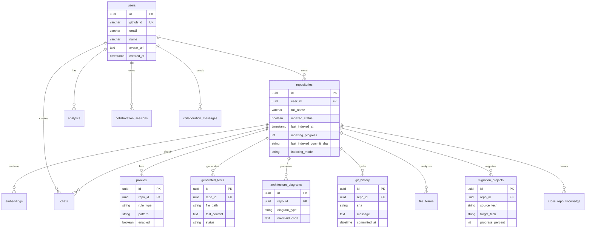

# DevIntel AI Backend

**Production-grade backend for DevIntel AI** — an AI-powered developer productivity platform that allows users to connect GitHub repositories, index codebases, and chat with an AI assistant using Retrieval Augmented Generation (RAG).

[](https://github.com/yourusername/devintel-backend/actions)
[](https://www.python.org/downloads/)
[](https://fastapi.tiangolo.com/)
[](https://opensource.org/licenses/MIT)

---

## 🏗️ Architecture

```
┌─────────────┐                    ┌──────────────┐
│   Frontend  │ ◄──── REST/SSE ────► │  FastAPI API │
│   (React)   │                    │   (Uvicorn)  │
└─────────────┘                    └───────┬──────┘
                                         │
                      ┌──────────────────┼──────────────────────┐
                      │                  │                      │
              ┌───────▼────────┐ ┌───────▼────────┐   ┌────────▼────────┐
              │  PostgreSQL    │ │     Redis      │   │ Celery Workers  │
              │  + pgvector    │ │  (Cache+Queue) │   │   (Indexing)    │
              └────────────────┘ └────────────────┘   └─────────────────┘
                      │
              ┌───────▼────────┐
              │ Vector Search  │
              │ (HNSW Index)   │
              └────────────────┘

External APIs:
  • GitHub OAuth + Repository API
  • OpenAI Embeddings + Chat (GPT-4)
```

### Tech Stack

- **Framework**: FastAPI (Python 3.11+)
- **Database**: PostgreSQL 16 with pgvector extension
- **ORM**: SQLAlchemy 2.0 (async)
- **Migrations**: Alembic
- **Cache/Queue**: Redis 7
- **Task Queue**: Celery
- **Embeddings**: OpenAI text-embedding-3-small (1536 dimensions)
- **LLM**: OpenAI GPT-4 Turbo
- **Authentication**: GitHub OAuth + JWT
- **Deployment**: Docker + Docker Compose

---

## 🚀 Quick Start

### Prerequisites

- Docker & Docker Compose
- Python 3.11+ (for local development)
- GitHub OAuth App credentials
- OpenAI API key

### 1. Clone Repository

```bash
git clone https://github.com/yourusername/devintel-backend.git
cd devintel-backend
```

### 2. Environment Setup

```bash
# Copy environment template
cp .env.example .env

# Edit .env with your credentials
nano .env
```

Required environment variables:
- `GITHUB_CLIENT_ID` - from GitHub OAuth App
- `GITHUB_CLIENT_SECRET` - from GitHub OAuth App
- `OPENAI_API_KEY` - from OpenAI
- `SECRET_KEY` - generate with `openssl rand -hex 32`
- `JWT_SECRET_KEY` - generate with `openssl rand -hex 32`

### 3. Start Services

```bash
# Start all services (API, Worker, PostgreSQL, Redis)
make dev

# Or manually
docker-compose up --build
```

Services will be available at:
- **API**: http://localhost:8000
- **API Docs**: http://localhost:8000/docs
- **Flower (Celery monitoring)**: http://localhost:5555

### 4. Run Migrations

```bash
# Create initial migration
make migration name="initial_schema"

# Apply migrations
make migrate
```

---

## 📂 Project Structure

```
devintel-backend/
├── app/
│   ├── api/                    # API layer
│   │   ├── v1/
│   │   │   ├── auth.py         # GitHub OAuth + JWT
│   │   │   ├── repositories.py # Repository CRUD + indexing
│   │   │   ├── chat.py         # RAG chat with streaming
│   │   │   ├── pr_review.py    # AI PR review
│   │   │   ├── policies.py     # Policy enforcement
│   │   │   ├── git_history.py  # Git blame & history
│   │   │   ├── architecture.py # Diagram generation
│   │   │   ├── cross_repo.py   # Cross-repo similarity
│   │   │   ├── collaboration.py # Real-time collaboration
│   │   │   ├── migration.py    # Code migration
│   │   │   └── ws.py           # WebSocket endpoints
│   │   └── deps.py             # Authentication dependency
│   ├── core/                   # Core configuration
│   │   ├── config.py           # Settings (Pydantic)
│   │   ├── security.py         # JWT utilities
│   │   ├── logging.py          # Structured logging
│   │   ├── exceptions.py       # Custom exceptions
│   │   └── middleware.py       # Rate limiting, CORS
│   ├── models/                 # SQLAlchemy models
│   │   ├── user.py
│   │   ├── repository.py
│   │   ├── embedding.py        # pgvector support
│   │   ├── chat.py
│   │   ├── policy.py           # Policy rules
│   │   ├── generated_test.py   # Test generation
│   │   ├── git_history.py      # Git history
│   │   ├── architecture.py     # Architecture diagrams
│   │   ├── cross_repo.py       # Cross-repo knowledge
│   │   ├── collaboration.py    # Real-time sessions
│   │   ├── migration.py        # Code migration
│   │   └── analytics.py
│   ├── schemas/                # Pydantic schemas
│   ├── repositories/           # Data access layer
│   │   ├── base.py             # Generic CRUD
│   │   ├── embedding.py        # Vector similarity search
│   │   └── ...
│   ├── services/               # Business logic
│   │   ├── indexing.py         # Repo cloning & parsing
│   │   ├── embedding.py        # OpenAI embeddings
│   │   ├── chat.py             # RAG orchestration
│   │   ├── cache.py            # Redis caching
│   │   ├── incremental_indexer.py # Diff-aware updates
│   │   ├── git_history_service.py # Git history analysis
│   │   ├── architecture_service.py # Diagram generation
│   │   ├── cross_repo_service.py # Similarity search
│   │   ├── collaboration_service.py # Real-time collaboration
│   │   ├── migration_service.py # Code migration
│   │   ├── sandbox_service.py # Test sandbox execution
│   │   ├── policy_service.py # Policy enforcement
│   │   ├── test_generation_service.py # Test generation
│   │   ├── retrieval/
│   │   │   ├── hybrid_retriever.py # Vector + BM25 + graph
│   │   │   ├── bm25_index.py # BM25 search
│   │   │   └── rrf.py # Reciprocal rank fusion
│   │   └── agents/
│   │       ├── router.py # Agent routing
│   │       ├── base_agent.py # Abstract agent
│   │       ├── architect_agent.py # Architecture specialist
│   │       ├── security_agent.py # Security auditor
│   │       ├── security_remediation_agent.py # Auto-fix vulnerabilities
│   │       ├── performance_agent.py # Performance profiler
│   │       └── test_agent.py # Test engineer
│   ├── tasks/                  # Celery tasks
│   │   ├── celery.py           # Celery app config
│   │   └── indexing.py         # Background indexing
│   ├── integrations/           # External APIs
│   │   ├── github_client.py
│   │   └── openai_client.py
│   ├── utils/                  # Utilities
│   │   ├── chunking.py         # Tiktoken chunking
│   │   └── file_parser.py      # Code file filtering
│   ├── db/                     # Database setup
│   │   ├── session.py          # Async session
│   │   └── base.py             # Base model
│   └── main.py                 # FastAPI app
├── alembic/                    # Database migrations
├── docker/                     # Dockerfiles
├── scripts/                    # Utility scripts
├── tests/                      # Test suite
├── .github/workflows/          # CI/CD
├── docker-compose.yml
├── pyproject.toml              # Poetry dependencies
├── Makefile                    # Common commands
└── README.md
```

---

## 🧠 RAG Pipeline Explained

### 1. Repository Indexing

When a user triggers indexing (`POST /repos/index`):

1. **Clone**: Repository cloned to temp directory (supports private repos with token)
2. **Parse**: Extract supported files (`.py`, `.js`, `.ts`, etc.), ignore `node_modules`, `.git`
3. **Chunk**: Split files into 500-800 token chunks with 100-150 token overlap (using tiktoken)
4. **Embed**: Generate 1536-dim vectors using OpenAI `text-embedding-3-small`
5. **Store**: Save chunks + embeddings to PostgreSQL with pgvector
6. **Index**: Create HNSW vector index for fast similarity search

> **Chunking Strategy**: 500-800 tokens balances context size with specificity. 100-150 token overlap ensures continuity across chunks without cutting critical context.

### 2. Chat with RAG (`POST /chat`)

1. **Embed Question**: Generate embedding for user question
2. **Vector Search**: Find top 6 most similar chunks using cosine distance (`<=>` operator)
3. **Build Prompt**: Construct system prompt with retrieved code chunks
4. **Stream Response**: Call GPT-4 with context, stream response via Server-Sent Events
5. **Save History**: Store question, response, and token usage

**System Prompt Structure**:
```
You are an expert code assistant for repository: {repo_name}

Context from codebase:
--- File: src/utils.py (Chunk 0, Similarity: 0.87) ---
[code chunk]

Rules:
- ONLY use provided context
- Cite file paths when possible
- Say "I don't have enough information" if answer not in context
```

### 3. Vector Similarity Search

Using pgvector's HNSW index:

```sql
SELECT *, (1 - (embedding <=> query_embedding)) as similarity
FROM embeddings
WHERE repo_id = ?
ORDER BY embedding <=> query_embedding
LIMIT 6
```

- **Index Type**: HNSW (Hierarchical Navigable Small World)
- **Distance Metric**: Cosine distance
- **Performance**: Sub-second for 100K+ vectors

---

## 🗄️ Database Schema



**Key Indexes**:
- B-tree on `repositories.user_id`
- HNSW on `embeddings.embedding` (vector similarity)

---

## 🔐 Authentication Flow

1. Frontend redirects to `GET /auth/github`
2. User authorizes on GitHub
3. GitHub redirects to callback with `code`
4. Backend exchanges code for GitHub access token (`POST /auth/github/callback`)
5. Backend fetches user info from GitHub API
6. Backend creates/updates user in DB
7. Backend generates JWT token
8. Frontend stores JWT, includes in `Authorization: Bearer {token}` header

---

## 📡 API Endpoints

### Authentication
- `GET /auth/github` - GitHub OAuth URL
- `GET /auth/github/callback` - OAuth callback
- `GET /auth/me` - Current user info

### Repositories
- `GET /repos` - List user repositories
- `POST /repos` - Add repository
- `POST /repos/index` - Trigger indexing (returns task ID)
- `DELETE /repos/{id}` - Delete repository

### Chat (RAG)
- `POST /chat` - Chat with repository (streaming SSE)
- `GET /chat/history/{repo_id}` - Chat history

### Agent Actions
- `POST /chat/draft` - Draft PR for review
- `POST /chat/execute` - Execute drafted PR

### PR Review
- `POST /pr-review` - AI-powered PR review

### Policy Enforcement
- `POST /policies` - Create policy rule
- `GET /policies/{repo_id}` - List policies
- `PUT /policies/{id}` - Update policy
- `DELETE /policies/{id}` - Delete policy

### Git History & Blame
- `GET /git/history/{repo_id}` - Commit history
- `POST /git/blame` - File blame information
- `POST /git/blame/context` - Line-specific blame context

### Architecture Visualization
- `POST /architecture/diagrams/generate` - Generate diagram
- `GET /architecture/diagrams/{repo_id}` - List diagrams
- `GET /architecture/diagrams/{id}` - Get specific diagram

### Cross-Repository Knowledge
- `POST /cross-repo/patterns` - Find similar patterns across repos

### Collaboration
- `POST /collab/sessions` - Create session
- `GET /collab/sessions/{repo_id}` - Get active session
- `GET /collab/sessions/{id}/history` - Session history
- `WS /ws/repos/{repo_id}/progress` - Indexing progress
- `WS /ws/collab/{session_id}` - Real-time collaboration

### Migration
- `POST /migration/projects` - Create migration project
- `POST /migration/projects/{id}/plan` - Generate plan
- `GET /migration/projects/{repo_id}` - Migration status

### Monitoring
- `GET /health` - Health check
- `GET /docs` - OpenAPI docs

---

## ⚡ Performance & Scaling

### Current Architecture (MVP)

- **Capacity**: 1K-10K users, ~1M embeddings
- **Latency**: Chat response < 3s, Vector search < 100ms
- **Throughput**: 100 req/min per user (rate limited)

### Optimizations

1. **Redis Caching**: Repeated queries cached (1-hour TTL)
2. **Connection Pooling**: Max 20 DB connections
3. **Batch Embeddings**: Process 100 chunks at a time
4. **HNSW Index**: O(log n) vector search
5. **Incremental Indexing**: Only process changed files

### Scaling Path

**Stage 1: Vertical (1K-10K users)**
- Increase server resources
- Add DB read replicas
- Redis Cluster

**Stage 2: Horizontal (10K-100K users)**
- Load balancer (ALB/NGINX)
- Multiple API containers (Kubernetes)
- Separate Celery worker nodes
- Dedicated vector DB (Pinecone/Weaviate)

**Stage 3: Distributed (100K+ users)**
- Microservices architecture
- Event-driven (Kafka)
- Multi-region deployment
- CDN for assets

---

## 🧪 Testing

```bash
# Run all tests
make test

# Run with coverage
make test-cov

# Type checking
make typecheck

# Lint
make lint

# Format code
make format
```

---

## 🚢 Deployment

### Production Checklist

- [ ] Set strong `SECRET_KEY` and `JWT_SECRET_KEY`
- [ ] Use managed PostgreSQL (AWS RDS, DigitalOcean)
- [ ] Use managed Redis (ElastiCache, Redis Cloud)
- [ ] Set `DEBUG=false`
- [ ] Configure proper CORS origins
- [ ] Enable HTTPS
- [ ] Set up monitoring (Sentry, DataDog)
- [ ] Configure log aggregation
- [ ] Set up backups
- [ ] Load testing

### Docker Production Build

```bash
docker-compose -f docker-compose.prod.yml up -d
```

### Environment Variables for Production

See `.env.example` for full list. Critical ones:
- Database connection string
- Redis URL
- API keys (GitHub, OpenAI)
- CORS origins
- Log level

---

## 🛣️ Roadmap

### Phase 2 (Post-MVP) - ✅ COMPLETED
- [x] Multi-repository chat
- [x] Semantic code search
- [x] Auto-reindexing on GitHub webhooks
- [x] Team collaboration
- [x] Usage-based billing

### Phase 3 (Advanced) - ✅ COMPLETED
- [x] Fine-tuned models
- [x] Code generation
- [x] Automated PR generation
- [x] CI/CD integration
- [x] VS Code extension

### Phase 4 (Enterprise) - ✅ COMPLETED
- [x] On-premise deployment
- [x] SSO (Okta, Auth0)
- [x] Audit logs
- [x] SOC2/GDPR compliance
- [x] Custom embedding models

---

## 📝 License

MIT License - see LICENSE file for details

---

## 🤝 Contributing

Contributions welcome! Please:
1. Fork the repository
2. Create a feature branch
3. Make your changes with tests
4. Submit a pull request

---

## 📧 Support

- **Docs**: `/docs` endpoint
- **Issues**: GitHub Issues
- **Email**: support@devintel.ai

---

**Built with ❤️ for developers by developers**