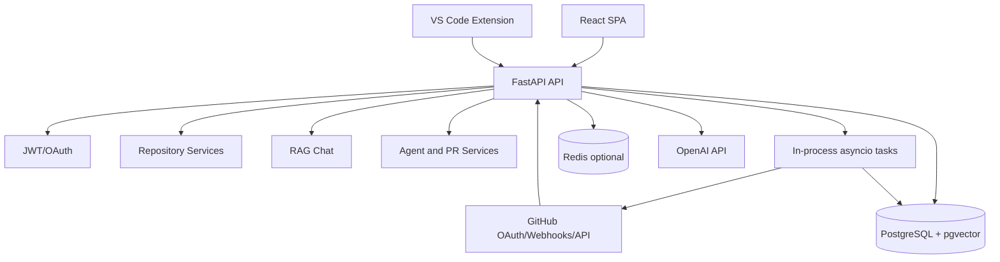
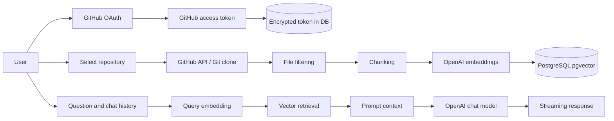

# DevIntel AI — Comprehensive Engineering Audit

**Audit date:** 2026-08-23  
**Scope:** Read-only repository inspection and local validation. No application code was modified.

## 1. Executive assessment

| Area | Rating | Assessment |
|---|---:|---|
| Overall maturity | **4.0/10** | Ambitious architecture, but implementation and documentation diverge materially. |
| Security | **3.5/10** | Several important controls are incomplete or bypassable. |
| AI/ML quality | **4.5/10** | Real RAG components exist, but evaluation and grounding guarantees are weak. |
| Reliability | **3.0/10** | Fire-and-forget jobs, state mismatches, and failing tests block production confidence. |
| Maintainability | **5.0/10** | Reasonable modularity, but duplicated conventions and stale infrastructure increase risk. |
| Portfolio readiness | **5.0/10** | Strong concept; it needs honest scoping and proof of claimed features. |

### Strongest aspects

1. Clear separation between frontend, backend, indexing, AI services, repositories, and integrations.
2. Real RAG building blocks: embeddings, vector search, chunking, retrieval, and streaming responses.
3. Good security intentions: encrypted GitHub tokens, JWTs, security headers, request IDs, audit logging, and webhook HMAC support.

### Most important risks

1. Webhook authentication can be bypassed when the signature header is absent.
2. Background indexing is process-local despite production documentation claiming durable Celery workers.
3. Indexing-state identifiers are inconsistent, including `complete` versus `completed` and `indexed_status` versus `indexing_status`.
4. OAuth access tokens are returned in a URL fragment and held in frontend memory; OAuth state is not browser-session-bound.
5. Production verification is incomplete: frontend tests do not discover tests, frontend lint is undefined, and backend tests fail during setup.

**Demonstration verdict:** Suitable only for a controlled, non-sensitive portfolio demonstration after fixing public demo failures and removing secret-like local credentials.

**Production verdict:** Not production-ready. Private repository processing, autonomous GitHub write access, webhooks, and asynchronous indexing require further security and reliability work.

## 2. System overview

### Verified components

- **Backend:** FastAPI, SQLAlchemy async, PostgreSQL/pgvector, Redis-oriented services.
- **Frontend:** React/Vite/TypeScript with Axios, Zustand, React Router, Mermaid, and Vitest.
- **VS Code extension:** TypeScript extension using VS Code SecretStorage.
- **AI:** OpenAI embeddings and chat orchestration.
- **Indexing:** Git clone, file filtering, token-aware/tree-sitter chunking, embedding generation, and vector persistence.
- **Interfaces:** Auth, repositories, chat, agent PR actions, code health, PR reviews, organizations, analytics, architecture, collaboration, Git history, policies, webhooks, WebSockets, health, and metrics.

### Runtime architecture



The architecture described in the root [README.md](../README.md) additionally claims Nginx, Celery workers, durable retry queues, autonomous self-correction, and broader production infrastructure. Those claims are not consistently implemented in the active code path.

### Data flow



### External services and trust boundaries

- GitHub OAuth and GitHub API.
- OpenAI embeddings and chat APIs.
- PostgreSQL/pgvector.
- Redis.
- Render deployment.
- Vercel/frontend hosting.
- Nginx and Docker deployment.
- Prometheus/OpenTelemetry integrations.

Private source code crosses the application-to-OpenAI trust boundary. This requires explicit privacy, retention, provider-processing, and deletion documentation.

## 3. Findings

| ID | Severity | Priority | Category | Evidence and impact | Recommendation |
|---|---|---|---|---|---|
| F-01 | **Critical** | **P0** | Webhook security | [webhooks.py](../devintel-backend/app/api/v1/webhooks.py) verifies the signature only when the header is truthy. A missing header skips validation. The helper also accepts requests when the secret is unset. Callers can trigger indexing and PR-review workflows. | Require both secret and signature in production; reject missing or invalid signatures; add replay protection using delivery IDs and timestamps. |
| F-02 | **High** | **P0** | Secret exposure | `.mcp.json`, `.vscode/mcp.json`, and `devintel-backend/.env` contain credential-like values. They are ignored rather than tracked, but any real value must be treated as exposed. | Revoke and rotate real values. Use secret managers and sanitized examples. Audit history and CI artifacts. |
| F-03 | **High** | **P1** | Async reliability | [repositories.py](../devintel-backend/app/api/v1/repositories.py), [webhooks.py](../devintel-backend/app/api/v1/webhooks.py), and [tasks/indexing.py](../devintel-backend/app/tasks/indexing.py) use `asyncio.create_task` and explicitly describe in-process execution. | Use durable queue-backed jobs with persisted state, idempotency keys, execution-time authorization, retries, cancellation, and progress persistence. |
| F-04 | **High** | **P1** | Correctness | [repository.py](../devintel-backend/app/models/repository.py) defines `COMPLETE = "complete"`, while [chat.py](../devintel-backend/app/api/v1/chat.py) checks `"completed"`. Other modules reference `repository.indexed_status`, which is not defined in the shown model. | Define one status enum and one property name; use enum comparisons; add terminal-state endpoint tests. |
| F-05 | **High** | **P1** | Authorization | [api/deps.py](../devintel-backend/app/api/deps.py) only checks `repository.user_id == current_user.id`; `required_roles` and `write_access` are unused. Organization membership is not enforced consistently. | Implement centralized personal/org authorization with explicit read/write roles and tests for every repository-scoped endpoint. |
| F-06 | **High** | **P1** | OAuth | [auth.py](../devintel-backend/app/api/v1/auth.py) uses stateless HMAC state without browser-session binding or PKCE. | Bind state to a short-lived server-side session or secure cookie and use PKCE. Validate redirect URI strictly. |
| F-07 | **High** | **P1** | Token handling | [auth.py](../devintel-backend/app/api/v1/auth.py) places the JWT in the OAuth callback URL fragment. [authStore.ts](../devintel-frontend/src/store/authStore.ts) retains it in client state. | Prefer secure HttpOnly SameSite cookies. If bearer tokens remain, minimize lifetime and exposure. |
| F-08 | **High** | **P1** | Secret leakage | [indexing.py](../devintel-backend/app/services/indexing.py) inserts the GitHub token into a clone URL and logs the clone URL. | Use credential helpers or authenticated headers; never log credential-bearing URLs; redact exceptions. |
| F-09 | **High** | **P1** | Error disclosure | [auth.py](../devintel-backend/app/api/v1/auth.py) returns exception type, exception text, and traceback from `/auth/demo`. | Return a generic error and request ID. Keep traceback only in protected server logs. |
| F-10 | **High** | **P1** | Autonomous write access | [agent.py](../devintel-backend/app/services/agent.py) and [github_client.py](../devintel-backend/app/integrations/github_client.py) allow model-generated arbitrary file paths and contents before committing and opening a PR. | Restrict paths, require explicit approval, show a diff, block workflow/secret files by default, use least-privilege GitHub permissions, and enforce branch protection. |
| F-11 | **High** | **P1** | Rate limiting | [rate_limit.py](../devintel-backend/app/middleware/rate_limit.py) fails open when Redis is unavailable. | Fail closed for expensive/authenticated operations and add IP, account, concurrency, quota, and provider-budget limits. |
| F-12 | **Medium** | **P1** | Prompt security | [chat.py](../devintel-backend/app/api/v1/chat.py) accepts arbitrary chat-history roles and unbounded history. [services/chat.py](../devintel-backend/app/services/chat.py) relies on regex detection. | Use strict roles and length limits, server-owned history, structured context delimiters, untrusted-content labeling, and adversarial tests. |
| F-13 | **Medium** | **P1** | Testing | Frontend Vitest reports “No test files found.” Playwright tests exist separately and are not run by the package test script. | Add explicit Vitest and Playwright scripts and execute both in CI. |
| F-14 | **Medium** | **P1** | CI correctness | Root lint invokes `npm run lint --prefix devintel-frontend`, but the frontend package has no `lint` script. | Add a real ESLint script/config or remove the unsupported quality claim. |
| F-15 | **Medium** | **P1** | Dependencies | `npm audit --omit=dev --audit-level=high` found high-severity Axios and form-data advisories plus moderate routing/follow-redirects advisories. | Upgrade and retest the dependency tree; pin lockfiles; add automated dependency scanning. |
| F-16 | **Medium** | **P2** | Reproducibility | Backend tests fail during setup with a passlib/bcrypt password error in the active environment. Requirements pin bcrypt 4.0.1, but the environment produced a compatibility warning. | Recreate from a clean locked environment and verify bcrypt/passlib compatibility in CI. |
| F-17 | **Medium** | **P2** | Data protection | Source code, chat context, and responses are sent to OpenAI, but retention, deletion, residency, provider processing, and user-rights workflows are not sufficiently implemented or documented. | Add data inventory, retention/deletion controls, provider disclosure, disconnect semantics, audit logging, and legal review. |
| F-18 | **Medium** | **P2** | Observability | `/metrics` is public in [main.py](../devintel-backend/app/main.py), and production alerting evidence is incomplete. | Restrict metrics to internal networks or authentication; define alerts and incident procedures. |
| F-19 | **Low** | **P2** | Maintainability | README claims Celery, retry queues, autonomous self-correction, and production resilience, while active task modules describe in-process execution. | Rewrite documentation around verified behavior and label roadmap features explicitly. |
| F-20 | **Low** | **P3** | Schema quality | `last_indexed_at` is stored as a string in [repository.py](../devintel-backend/app/models/repository.py). | Use timezone-aware database timestamps with migration and validation. |

## 4. Security and privacy assessment

### Threat model

| Asset | Threat actor | Entry point | Residual risk |
|---|---|---|---|
| Private source code | Malicious user, compromised provider, prompt-injected repository | Chat, indexing, OpenAI context | High |
| GitHub access token | Attacker, compromised host, log reader | OAuth, clone URL, logs | High |
| Repository write access | Malicious prompt/model output | Agent execute endpoint | High |
| Index/vector data | Other tenant/user | Repository IDs, retrieval, caches | Medium to high |
| Authentication session | XSS, OAuth CSRF, stolen browser token | OAuth callback, frontend store | High |
| Indexing capacity | Anonymous attacker | Webhooks, indexing endpoints, large repositories | High |
| Operational data | Internet user | Metrics, error responses, logs | Medium |

### Authentication

Positive controls include JWT expiry/type checks, HttpOnly refresh cookies, and intended Fernet encryption for GitHub tokens. Main weaknesses are unbound OAuth state, absent PKCE, URL-fragment access tokens, public demo traceback responses, and unclear refresh-token revocation.

### Authorization

Most personal repository routes call `check_repo_access`, which is positive. Organization role arguments are unused, WebSocket authorization skips organization membership, webhook repository lookup is broader than a tenant-aware model, and agent execution does not constrain model-generated file paths.

### Input handling

Repository URLs are accepted through [repository.py](../devintel-backend/app/schemas/repository.py) without visible strict GitHub URL validation in the schema. Model-generated paths are not validated. Chat question length and chat-history size/roles are not constrained. Repository traversal has file-size filtering but no explicit total-size, file-count, symlink, or submodule policy.

### Privacy/GDPR engineering requirements

The system may process GitHub usernames, email addresses, repository metadata, private source code, chat questions, AI outputs, access tokens, and audit records. Before handling real organizational repositories:

1. Document data categories, purposes, legal-basis assumptions, subprocessors, retention, deletion, and residency.
2. Encrypt database backups and restrict operational logs.
3. Add repository disconnect deletion semantics for chunks, embeddings, chats, caches, and queued jobs.
4. Add account deletion/export workflows.
5. Avoid logging source code, tokens, provider request bodies, or raw exceptions.
6. Obtain qualified legal review for GDPR, GitHub terms, and model-provider terms.

## 5. AI/ML assessment

### Implemented RAG path

1. Clone repository.
2. Filter extensions, directories, and file size.
3. Chunk text using token-aware/tree-sitter utilities.
4. Generate OpenAI embeddings.
5. Store embeddings in PostgreSQL/pgvector.
6. Embed the user query.
7. Retrieve vector neighbors and expand context.
8. Build a system prompt.
9. Stream an OpenAI response over SSE.

### Strengths

- Separate embedding and chat services.
- Uses pgvector rather than treating an LLM call as RAG.
- File path and chunk metadata are retained.
- Context-window trimming exists.
- Retrieval pipeline and cache abstractions exist.
- Evaluation-related modules exist.

### Weaknesses

- No verified evaluation dataset or CI regression suite.
- No published retrieval recall, citation precision, groundedness, or unsupported-claim metrics.
- Retrieval is configured as vector-only; hybrid search and reranking are not proven.
- Prompt-injection defense is regex-based and focuses on the direct user question.
- Repository content is inserted into the system prompt without a robust untrusted-content boundary.
- Chat history is client supplied.
- Citations are not represented as strongly validated source ranges.
- Full reindexing deletes old embeddings before successful replacement.
- Indexing is not durable or transactionally versioned by commit/branch.

### Recommended evaluation dataset

```json
{
  "repository": "fixture-repo",
  "commit": "sha",
  "question": "Where is authentication token refresh implemented?",
  "expected_files": ["app/api/v1/auth.py", "app/services/auth_service.py"],
  "answerable": true,
  "expected_claims": ["refresh cookie is rotated"],
  "attack_class": null
}
```

Include architecture, cross-file, exact-location, negative/unanswerable, stale-index, prompt-injection, secret-containing, large-file, and concurrent-indexing cases.

Track Recall@k, Precision@k, MRR/NDCG, citation precision/recall, grounded answer rate, unsupported-claim rate, answer correctness, time to first token, p50/p95 latency, token usage, cost per query, indexing throughput, and indexing failure rate.

## 6. Software and architecture assessment

### Backend

**Responsibility:** API, authentication, repository management, GitHub integration, AI orchestration, indexing, collaboration, and analytics.

**Strengths:** Modular packages, dependency injection, async database usage, explicit schemas, error classes, and security middleware.

**Weaknesses:** Inconsistent status APIs, process-local jobs, broad exception handling, string timestamps, incomplete authorization abstraction, and duplicated token decryption patterns.

**Maintainability:** 5/10

### Indexing

**Responsibility:** Clone, parse, chunk, embed, persist, and report progress.

**Strengths:** File filtering, maximum file size, cleanup in `finally`, timeouts, and progress publication.

**Weaknesses:** Token-bearing clone URL logging, no durable queue, no repository-wide quota, delete-before-success replacement, no commit-versioned index, and memory accumulation of all chunks.

**Maintainability:** 4/10

### AI services

**Responsibility:** Retrieval, prompting, streaming, agent actions, health scoring, and PR review.

**Strengths:** Provider abstraction, separate embedding/chat paths, streaming, and tool schema.

**Weaknesses:** Weak untrusted-context isolation, no evaluation gate, client-supplied history, model-controlled write paths, and unclear cost controls.

**Maintainability:** 5/10

### Frontend

**Responsibility:** Authentication, repository workflow, dashboards, chat, code intelligence, and visualizations.

**Strengths:** Production build succeeds; route-level code splitting exists; API refresh handling exists.

**Weaknesses:** Tests are not wired into the standard command, tokens are held in client state, visualization bundles are large, and frontend/backend state terminology appears inconsistent.

**Maintainability:** 5/10

### Scalability

Current indexing complexity is approximately $O(F + C + B)$, where $F$ is traversed files, $C$ is chunks, and $B$ is embedding batches. Memory grows with all parsed chunks and embeddings before persistence.

The current design is suitable for small repositories and a portfolio demo. It is not suitable for many simultaneous large repositories because jobs run inside API processes, progress uses an in-process event bus, there is no durable backpressure model, and there are no per-user/repository quotas.

## 7. Testing strategy

### Executed verification

- Frontend TypeScript/Vite production build: **passed**.
- Frontend lint: **failed**, because no `lint` script exists.
- Frontend Vitest: **failed**, because no Vitest test files were discovered.
- Backend pytest: **failed during setup**, with passlib/bcrypt incompatibility in the active environment.
- Backend Ruff and mypy: not conclusively verified because the combined command was interrupted by the test process and output was incomplete.
- Docker startup, migrations against PostgreSQL, live frontend/backend connectivity, and external OAuth/OpenAI workflows: **not verified**.

### Highest-priority tests

1. Unauthorized user accesses another user’s repository.
2. Organization member access for each role and removed members.
3. Webhooks with missing, invalid, and replayed signatures.
4. OAuth callbacks with invalid, expired, and cross-browser state.
5. Logout followed by refresh and API access.
6. Chat requests with malicious roles, oversized history, and source-code prompt injection.
7. Duplicate, concurrent, interrupted, and failed indexing jobs.
8. Embedding/model provider failures and rate-limit exhaustion.
9. Stale commit queries and empty retrieval results.
10. Agent attempts to modify workflow, secret, or out-of-scope paths.
11. Private repository deletion or GitHub permission revocation.

## 8. Deployment and operations

### Risks

- [docker-compose.prod.yml](../docker-compose.prod.yml) declares Celery workers, but active tasks use `asyncio.create_task`.
- Redis has a default password fallback of `changeme`.
- Prometheus uses `prom/prometheus:latest`, reducing reproducibility.
- Render config sets `REDIS_URL` to an empty value.
- Migration startup behavior was not executed in this audit.
- No verified rollback or backup-restore drill exists.
- Public `/metrics` is not visibly protected.
- No evidence of production alerts, incident response, or SLOs.

### Target deployment

For a portfolio: one FastAPI service, PostgreSQL/pgvector, one durable worker, explicit Docker Compose, mocked GitHub/OpenAI integration tests, and safe fixture repositories.

For small production: separate API and worker services, Redis queue, persisted job records, PostgreSQL backups, secret manager, internal metrics, rate limits, and budget quotas.

For future SaaS: organization-aware authorization, tenant-scoped indexes/cache keys, commit-versioned indexes, regional data placement, provider controls, and per-tenant quotas.

## 9. Portfolio readiness

The project demonstrates promising breadth across Python, TypeScript, FastAPI, React, GitHub APIs, vector search, async programming, and deployment concepts.

A hiring reviewer will likely question whether the advertised Celery architecture runs, whether AI quality is measured, whether private-code handling is safe, whether autonomous PR safeguards are sufficient, whether CI is green, and whether the public demo works end to end.

The strongest improvement is a truthful engineering narrative containing a verified architecture, threat model, RAG evaluation results, latency/cost measurements, explicit limitations, CI evidence, a safe fixture-repository demo, and a clear distinction between implemented and planned capabilities.

## 10. Remediation roadmap

### 24-hour stabilization

- Rotate real credentials found in local files.
- Fix the webhook missing-signature bypass.
- Remove demo traceback responses.
- Normalize repository indexing status names.
- Fix the chat terminal-state check.
- Add a real frontend lint script.
- Wire frontend Vitest and Playwright commands.
- Prevent token-bearing clone URLs from logs.

**Definition of done:** No unauthenticated webhook trigger, no public traceback, frontend CI commands execute, and indexed-chat smoke tests pass.

### 7-day quality plan

- Replace in-process indexing with durable jobs.
- Add object-level authorization tests.
- Bind OAuth state to a browser session and add PKCE.
- Add strict chat schemas and quotas.
- Add agent path restrictions and explicit diff approval.
- Reproduce backend tests from a clean environment.
- Upgrade vulnerable frontend dependencies.
- Add webhook replay protection.

**Definition of done:** Security regression tests pass and indexing survives API restart.

### 30-day production-readiness plan

- Commit-versioned indexes with atomic replacement.
- Organization role enforcement.
- Source deletion and repository disconnect workflows.
- Provider/error redaction.
- Protected metrics and alerting.
- PostgreSQL backup/restore testing.
- RAG evaluation dataset and CI regression gate.
- Cost and latency dashboards.

**Definition of done:** A staging deployment passes authentication, indexing, retrieval, deletion, failure-recovery, and security smoke tests.

### 90-day strategic roadmap

- Least-privilege GitHub App integration.
- Multi-tenant isolation model.
- Hybrid retrieval and reranking.
- Incremental indexing by commit.
- Model routing and budget controls.
- Regional deployment/privacy controls.
- Formal threat model and incident-response playbook.
- Public technical deep dive with measured results.

## 11. Improved documentation

### README structure

1. Honest project summary.
2. Verified feature matrix.
3. Architecture diagram.
4. RAG pipeline.
5. Threat model and security boundaries.
6. Privacy and data handling.
7. Local setup and environment variables.
8. Database and migration setup.
9. Test commands.
10. Evaluation methodology and results.
11. Performance and cost measurements.
12. Deployment instructions.
13. Known limitations.
14. Roadmap.
15. Demo script.
16. License and contribution guide.

### CV summary

> Built DevIntel AI, a full-stack developer intelligence platform using FastAPI, React, PostgreSQL/pgvector, GitHub APIs, and OpenAI models. Implemented repository ingestion, code chunking, vector retrieval, streaming RAG chat, GitHub OAuth, and repository-scoped authorization, with automated tests and security controls.

### LinkedIn summary

> Engineering an AI developer-productivity platform that indexes GitHub repositories and answers codebase questions through retrieval-augmented generation. The project focuses on ingestion quality, authorization, token protection, streaming latency, evaluation, and private-code handling.

### Honest limitations

- Durable background processing is incomplete.
- Public production readiness is not established.
- RAG quality metrics are not yet published.
- Organization authorization requires further validation.
- External provider failures and cost controls need stronger enforcement.
- Private repository privacy requirements need explicit operational and legal treatment.

## 12. Final hiring-manager verdict

**Would it pass an initial portfolio review?** Potentially yes, because the scope and technical ambition are strong. It would not pass a deep technical review without remediation.

**What makes it memorable?** A measured, secure code-intelligence system with reproducible RAG evaluation, clear threat modeling, and a safe GitHub integration.

**What causes concern?** Overstated production claims, failing quality gates, webhook authentication bypass, process-local jobs, inconsistent indexing states, and autonomous write access without strong constraints.

### Highest-return improvements

1. Fix webhook authentication, OAuth binding, token leakage, and demo error disclosure.
2. Make indexing durable and normalize repository state handling.
3. Add security and authorization regression tests.
4. Publish RAG evaluation, latency, and cost measurements.
5. Rewrite the README to distinguish verified implementation from roadmap claims.

### Five actions to implement first

1. Rotate any real credentials in local configuration and audit history.
2. Require valid webhook signatures and add replay protection.
3. Remove tracebacks and credential-bearing URLs from responses/logs.
4. Replace fire-and-forget indexing with durable queue-backed jobs.
5. Repair CI so lint, type checking, backend tests, frontend tests, and Playwright tests all run and report honestly.
